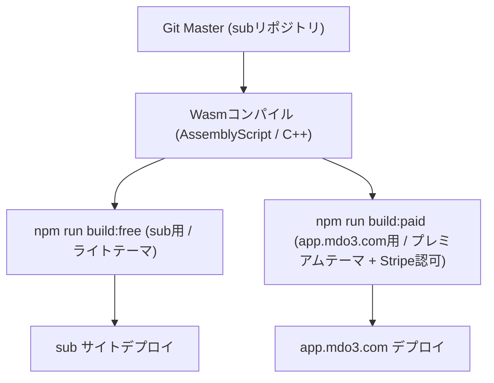

Edited MDO3_PORTAL_HANDOVER_PLAN.md

ご質問ありがとうございます。非常に明確で素晴らしい事業構想ですね！
ご提示いただいた要件に基づき、**「① ツール群の2サイト同期に関する問題点と解決策」**、および**「② `mdo3.com` 基幹ポータル構築に向けた申し送り計画」**をまとめました。

申し送り用のマークダウンファイルとして [MDO3_PORTAL_HANDOVER_PLAN.md](file:///C:/Users/049sm/.gemini/antigravity-ide/brain/d7a632d9-fe3a-42a6-a03a-476da9ab2398/MDO3_PORTAL_HANDOVER_PLAN.md) を作成いたしましたので、次の `mdo3` チャット開始時にそのままお使いいただけます。

---

### PART 1: ツール群の2サイト同期（`sub` ⇔ `app.mdo3.com`）に関する問題点・解決方法・構築手順

#### 1. 2サイト同期における問題点と課題
1. **ソースコードの二重管理と改修乖離リスク**:
   - 無料/社内版（`sub`）と有償SaaS版（`app.mdo3.com`）でファイルを別々に手動管理すると、計算ロジックの修正や機能追加時にバージョン不一致やバグが発生します。
2. **デザイン（CSS）の明確な差別化と共通化の両立**:
   - 計算ロジックやUI構造は同一に保ちつつ、見た目（カラーパレット、フォント、プレミアム感、有料版ロゴ等）だけを確実に切り替える仕組みが必要です。
3. **計算ロジックの秘匿化 (WebAssembly / Wasm 化)**:
   - ブラウザ上で動作するJavaScriptはソースコードが露出するため、学術成果や独自アルゴリズムを難読化・秘匿化するために Wasm 化パイプラインの構築が必要です。
4. **アクセス認可・Stripe決済状態との連動**:
   - `app.mdo3.com` では、ログイン情報だけでなく「Stripeサブスクリプションが有効であるか」のリアルタイム判定が必須となります。

---

#### 2. 解決方法とアーキテクチャ

1. **シングルソース管理 (Single Source of Truth)**:
   - `sub` リポジトリを「唯一のマスター」とし、すべての計算ロジック・テンプレートをここで開発します。
2. **CSSテーマの分離 (`theme-paid.css` / `theme-free.css`)**:
   - `common.css` にCSS変数を定義し、有償版（`app.mdo3.com`）には「ダークネイビー＆ロイヤルゴールド」などの高級感あるプレミアムテーマを適用します。
3. **WebAssembly (Wasm) パイプラインの構築**:
   - **AssemblyScript** (TypeScript風文法でWasmを出力) または C++ を採用し、`npm run build:wasm` で `.wasm` バイナリとJSラッパーを生成します。
   - ブラウザ側は `.wasm` を読み込んで計算を実行するため、元のJSコードは完全に隠蔽されます。
4. **ビルド＆自動デプロイスクリプト**:
   - `npm run build:paid` を実行すると、CSSを有償版に差し替え、Stripe認可チェックコードを挟んだ状態で `app.mdo3.com` へ自動デプロイする仕組みを構築します。

---

### PART 2: `mdo3.com` 基幹ポータル構築に向けた申し送りドキュメント

`mdo3` チャットでの開発開始用に作成した申し送り用ファイルを保存いたしました：
👉 [MDO3_PORTAL_HANDOVER_PLAN.md](file:///C:/Users/049sm/.gemini/antigravity-ide/brain/d7a632d9-fe3a-42a6-a03a-476da9ab2398/MDO3_PORTAL_HANDOVER_PLAN.md)

#### 申し送りファイルの主なアジェンダ
1. **全体ドメイン・サブドメイン構成一覧** (`mdo3.com`, `app`, `az`, `map`, `re`, `report_tokyo`, `[tenant].mdo3.com`)
2. **旧環境（`app.mdo3.com`）の初期化手順**: Stripeサブスク・note+・X過去投稿の全削除と新Stripe構造への移行
3. **サブドメイン間SSO（共通ログインセッション `Domain=.mdo3.com`）の設計**
4. **Cloudflare Stream × Stripe 連動 (動画講座の署名付きURLセキュリティ設計)**
5. **note+ / X (Twitter) 自動SNSマーケティング投稿パイプライン**
6. **フェーズ別構築ロードマップ (Phase 1 〜 Phase 5)**

---

### 次のステップへのご案内

1. **こちらのツール（`sub`）側**:
   - Wasm化用コンパイル環境（AssemblyScript）の導入と有償版CSSテーマ（`theme-paid.css`）の作成準備をいつでも進められます。
2. **`mdo3` チャット側**:
   - `mdo3` チャットを開いた際、作成した [MDO3_PORTAL_HANDOVER_PLAN.md](file:///C:/Users/049sm/.gemini/antigravity-ide/brain/d7a632d9-fe3a-42a6-a03a-476da9ab2398/MDO3_PORTAL_HANDOVER_PLAN.md) の内容を提示して、**Phase 1（Stripe/SNSクリーンアップおよび基幹SSOデータベース構築）** から開発を開始するよう指示してください。